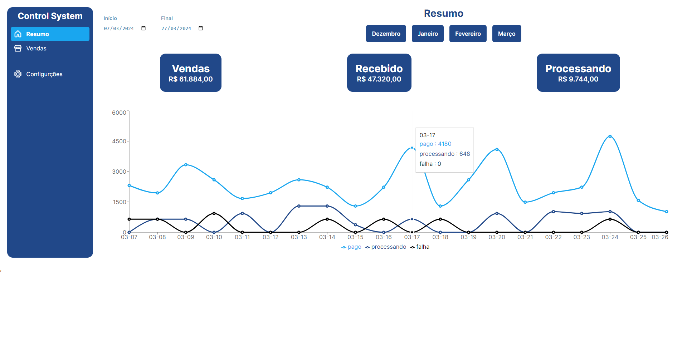

  ## 💻  Control Systema

### 🔥 Introdução

O control systema é um sistema web simples de controle de vendas onde você pode verificar suas vendas, vendas a receber e vendas que ainda estão processando para recebimento. O mesmo utiliza uma api para monitorar todas as informações, as vendas podem ser consultas de até 90 dias atrás, depois disso ja é não é mais possível pois as mesmas são zeradas pela api.





 ## :rocket: Tecnologias

Esse projeto foi desenvolvido com as seguintes tecnologias:

✔️TypeScript

✔️React-vite

✔️Styled-components

✔️ Fetch

✔️Phosphor Icons

✔️ react-router-dom


## ⚙ Configuração

```
- $ git clone https://github.com/diegofchagas/control-system.git

- Para instalar as dependências:
> npm i

- Vá para a pasta do projeto

- Para iniciar a aplicação:
> npm run dev
```

### 🆙 Atualizações futuras

- Melhoraria na responsividade ao projeto.

## Desenvolvedor 
<span style="font-size: larger;">**Diego Chagas**</span>